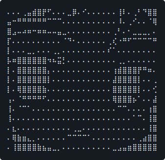

<hr>

 

```yaml
jason@jktrn
———————————
os: Windows 10 Pro x86-64
host: Gigabyte Technology Co., Ltd. B550M DS3H
cpu: AMD Ryzen 5 3600 @ 3.600GHz
gpu: NVIDIA GeForce GTX 1650 SUPER
shell: bash 4.4.23
———————————
blog: https://enscribe.dev/
discord: enscribe#1579
mailto: jason@enscribe.dev
———————————
langs: .js/ts, .c(pp), .py, .cs, .html, .css
learning: .rs, hexo, react/tailwind, neovim
commits: 514
```

<hr>
